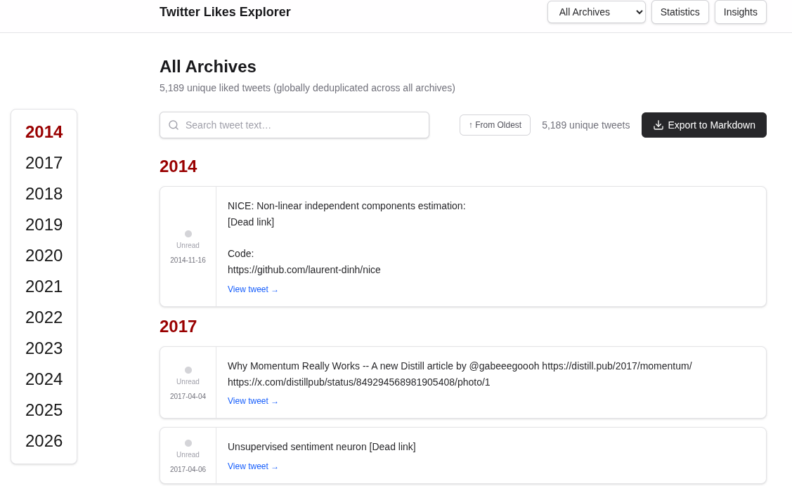
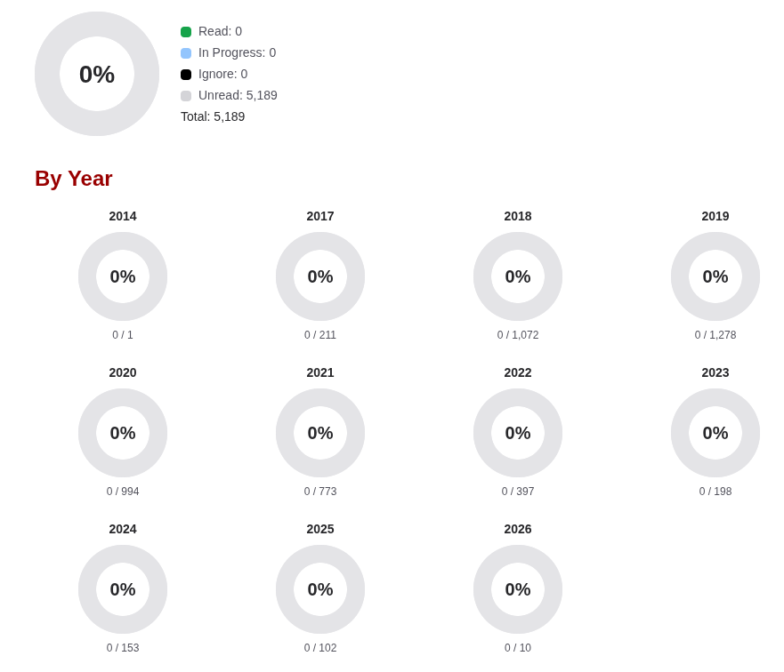
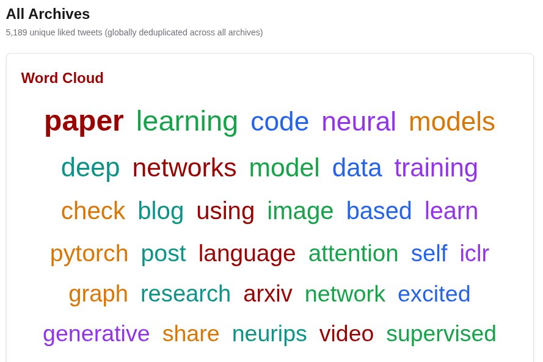

# Twitter Archive Explorer
## Rev: 2026-02-24

A Next.js dashboard for browsing, searching, and tracking liked tweets from your Twitter data archive exports.

Twitter's Data Privacy feature lets you download your complete account data as a self-contained archive. This project provides an interactive UI to explore those archives without being logged in for every action.

## Screenshots

### Tweet List
<!-- TODO: Add screenshot of the main tweet list view -->


### Statistics
<!-- TODO: Add screenshot of the statistics tab -->


### Word Cloud
<!-- TODO: Add screenshot of the insights/word cloud tab -->


## Features

- **Multi-archive support** — load multiple Twitter data exports and browse them individually or as a single deduplicated view
- **Full-text search** — filter tweets by keyword in real time
- **Read tracking** — click the dot on any tweet to mark it read/unread; batch save pending changes
- **Statistics** — read/unread progress bars, overall and broken down by year
- **Word cloud** — most frequent words across all tweet text; click a word to see matching tweets; dismiss irrelevant words
- **Year navigation** — year divider headings in the tweet list with a sticky side panel for quick jumps on wide screens
- **Markdown export** — download any archive view as a `.md` file
- **URL expansion** — `t.co` short links are expanded to their real destinations

## Prerequisites

- **Node.js v18+**
- **npm v8+**
- One or more Twitter data archives (exported via [Twitter's data download](https://twitter.com/settings/download_your_data))

## Setup

### 1. Add your archives

Place your exported Twitter archive folders inside `zip/`:

```
zip/
├── twitter-2022-02/
├── twitter-2023-12/
├── twitter-2024-11/
└── ...
```

Ensure each folder contains `data/like.js`. Archives are detected automatically.

### 2. Install dependencies

```bash
cd dashboard
npm install
```

### 3. (Recommended) Build the URL expansion cache

Expands `t.co` short URLs to their real destinations:

```bash
npm run expand-urls
```

This is resumable — safe to interrupt and re-run. Dead links are stored as `null` and shown as `[Dead link]` in the UI. Previously dead links are automatically rechecked on each run.

### 4. Start the dashboard

```bash
npm run dev
```

Open **http://localhost:3000** in your browser. The app reads archive data directly from `../zip/` via server-side file reads.

## Optional Steps

### Generate CONSOLIDATED.md

Produces a single Markdown file of all liked tweets with a `Read: No/Yes` field for manual tracking:

```bash
npm run generate-consolidated
```

Output: `asset/CONSOLIDATED.md`. Append-only — existing entries and manual edits are preserved on re-run.

### Generate word cloud data

Precomputes the top 500 most frequent words for the Insights tab:

```bash
npm run generate-word-cloud
```

Output: `asset/word-cloud.json` and `asset/IGNOREDWORDS.md`. User-dismissed words are preserved across regenerations.

## Routes

| URL | Description |
|-----|-------------|
| `/` | Redirects to `/archive/all` |
| `/archive/all` | All archives merged, globally deduplicated |
| `/archive/all/export` | Download combined Markdown export |
| `/archive/{name}` | Single archive view |
| `/archive/{name}/export` | Download that archive's Markdown export |

## Project Structure

```
twitter-archive-explore/
├── zip/                        # Twitter data archives (read-only)
│   └── twitter-YYYY-MM(-DD)/
│       ├── Your archive.html   # Twitter's built-in viewer
│       └── data/
│           ├── like.js         # Liked tweets
│           ├── tweet.js        # Your tweets
│           └── ...             # 60+ other data files
├── dashboard/                  # Next.js app
│   └── src/
│       ├── app/                # Pages and API routes
│       ├── components/         # React components
│       ├── lib/                # Parsers, utilities, word cloud logic
│       └── scripts/            # CLI scripts (expand-urls, generate-*, seed)
├── asset/                      # Generated files (gitignored)
│   ├── url-cache.json
│   ├── word-cloud.json
│   ├── IGNOREDWORDS.md
│   └── CONSOLIDATED.md
└── scripts/                    # Git hooks
```

## Commands

All commands run from inside `dashboard/`:

| Command | Description |
|---------|-------------|
| `npm run dev` | Start dev server at http://localhost:3000 |
| `npm run build` | Production build |
| `npm run start` | Serve production build |
| `npm run expand-urls` | Build/update the t.co URL expansion cache |
| `npm run generate-consolidated` | Create or append to `asset/CONSOLIDATED.md` |
| `npm run generate-word-cloud` | Generate or refresh word cloud frequencies |
| `npm test` | Run unit tests (Vitest) |

## Archive Data Format

Twitter data files use this pattern:

```javascript
window.YTD.category.part0 = [
  { /* data object */ },
  ...
]
```

The field-level reference for all 70+ data types is in `zip/<archive>/data/README.txt`.

## Viewing Raw Archives

Each archive includes Twitter's built-in viewer — open `Your archive.html` in a desktop browser:

```bash
xdg-open zip/twitter-2024-11/"Your archive.html"
```

## License
MIT, (c) Sourav
